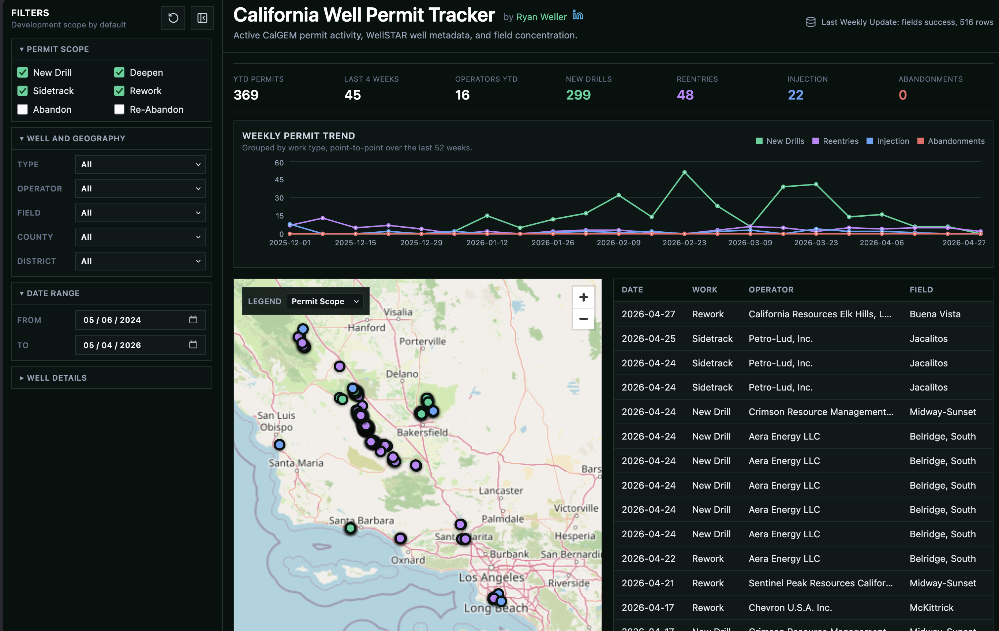

# California Well Permit Tracker

California Well Permit Tracker is a public web app for monitoring California oil and gas well permit activity using CalGEM and WellSTAR public data.

The project is designed as an oilfield activity intelligence tool rather than a generic dashboard. It helps users see who is actively permitting wells, what work is being permitted, where activity is concentrated, and how to jump from a permit record back to official state sources.



## What It Shows

- Current permit activity by operator, field, county, district, well type, and notice type.
- Default development-focused scope: New Drill, Deepen, Sidetrack, and Rework.
- Abandon and Re-Abandon records available as optional filters, but off by default.
- Weekly permit trends grouped by New Drills, Reentries, Injection, and Abandonments.
- Map-based activity view with configurable coloring by Permit Scope, Well Type, Operator, or Date.
- Scrollable permit table with clickable WellSTAR detail links.
- Official WellSTAR detail links using normalized California API numbers.
- WellFinder links where available.

## Data Sources

This app uses public California data services and does not require private CalGEM credentials for V1.

- Permits: [WellSTAR Notices layer 1](https://gis.conservation.ca.gov/server/rest/services/WellSTAR/Notices/MapServer/1)
- Wells: [WellSTAR Wells layer 0](https://gis.conservation.ca.gov/server/rest/services/WellSTAR/Wells/MapServer/0)
- Field boundaries: [CalGEM DOMS Admin Bounds](https://gis.conservation.ca.gov/server/rest/services/CalGEM/DOMS_Admin_Bounds/FeatureServer)
- WellFinder context: [CalGEM Well Finder](https://conservation.ca.gov/calgem/Pages/Wellfinder.aspx)

## Project Status

V1 is a working prototype with:

- React + Vite + TypeScript + Tailwind frontend.
- Supabase hosted Postgres database with public-read app tables/views.
- Python ingest scripts for CalGEM ArcGIS REST services.
- GitHub Actions workflow for weekly data refresh.
- Cloudflare Pages deployment target for `ca-permits.ryweller.com`.

Depth and completion interval data are intentionally treated as a future enrichment step. V1 stores placeholder depth/target fields and links users to the official WellSTAR detail page when those values are not available in the public ArcGIS layers.

## Repository Layout

```text
backend/                 Python ingest and Supabase upsert scripts
frontend/                React/Vite app
supabase/migrations/     Database schema and RLS setup
docs/                    Product, architecture, and data notes
tests/                   Python ingest/normalization tests
.github/workflows/       Weekly ingest automation
```

## Local Setup

Create a Supabase project first, then run the initial migration from:

```text
supabase/migrations/001_initial_schema.sql
```

Copy `.env.example` to `.env` and fill in:

```bash
VITE_SUPABASE_URL=https://your-project.supabase.co
VITE_SUPABASE_ANON_KEY=your-anon-key
SUPABASE_URL=https://your-project.supabase.co
SUPABASE_SERVICE_ROLE_KEY=your-secret-or-service-role-key
```

Newer Supabase projects may call the private write key a secret key and show it with an `sb_secret_` prefix. Older projects may show a JWT-style `service_role` key. Do not commit `.env`.

## Run The App Locally

```bash
cd frontend
npm install
npm run dev
```

Open the local Vite URL, usually `http://localhost:5173` or `http://localhost:5174`.

## Run The Ingest

```bash
python -m venv .venv
source .venv/bin/activate
pip install -r backend/requirements.txt
python backend/run_ingest.py
```

The ingest loads wells, permits, and fields, normalizes API numbers, deduplicates permit records, validates expected source fields, and upserts into Supabase.

## Tests

```bash
pytest tests
cd frontend
npm test
npm run lint
npm run build
```

## GitHub Actions

Add these repository secrets before enabling the weekly ingest workflow:

- `SUPABASE_URL`
- `SUPABASE_SERVICE_ROLE_KEY`

The workflow at `.github/workflows/weekly-ingest.yml` runs weekly and can also be triggered manually from GitHub.

## Cloudflare Pages

Recommended Cloudflare Pages settings:

- Framework preset: Vite
- Build command: `npm run build`
- Build output directory: `frontend/dist`
- Environment variables:
  - `VITE_SUPABASE_URL`
  - `VITE_SUPABASE_ANON_KEY`

Connect `ca-permits.ryweller.com` after the first successful deploy. DNS is case-insensitive, so this also covers the requested `CA-permits.ryweller.com` presentation.

## Design Direction

- Keep the interface dense, modern, and useful for repeat analysis.
- Keep the map and permit table as the primary workspace.
- Keep filters compact and collapsible.
- Avoid over-interpreting permit types without depth, formation, pool, and completion context.
- Reserve future field narratives for when richer geologic and wellbore data are available.

## License

This project is licensed under [CC BY-SA 4.0](LICENSE.md).
