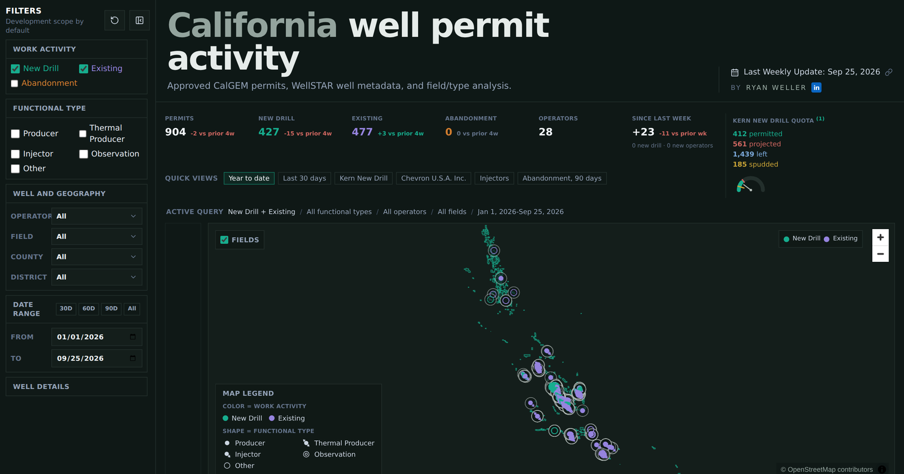

# California well permit activity

A public web app ([permits.ryweller.com](https://permits.ryweller.com)) for monitoring approved California oil and gas well permits, plus Kern County drilling activity, using public CalGEM, WellSTAR, and Baker Hughes data.

The project is designed as an oilfield activity intelligence tool rather than a generic dashboard. It helps users see who is actively permitting wells, what work is being permitted, where activity is concentrated, and how to jump from a permit record back to official state sources.



## What It Shows

- Approved permit activity by operator, field, county, district, functional well type, and work activity.
- Searchable multi-select filters that list only values with permits under the other active filters.
- Quick views, a "since last week" KPI, and the Kern County SB237 New Drill quota gauge.
- Default development-focused scope: New Drill and Existing work, with Abandonment available but off by default.
- Date filters and trend charts use the WellSTAR determination/approval date when available.
- Weekly permit momentum grouped by New Drill, Existing, and Abandonment.
- Map-based activity view where symbol shape represents functional well type and color represents work activity.
- Shareable filter URLs for persistent operator, field, county, date, and permit-scope views.
- Compact permit record table with expanded CSV export, determination/filed dates, and clickable WellSTAR detail links.
- `/drilling`: Kern permits vs drilling activity (spudded wells by approval month, approval-to-spud lag, weekly approvals and spuds with rig counts, undrilled inventory, operator insights).
- `/prod`: rough California oil decline and Kern County New Drill quota sensitivity model.
- Pool names in the permit detail drawer.
- Operator analysis panels for field concentration and cumulative drilling activity.
- Official WellSTAR detail links using normalized California API numbers.
- WellFinder links where available.
- Public metadata for search, social sharing, app icons, and large-card previews.

## Data Sources

This app uses public California data services and does not require private CalGEM credentials for V1.

- Permits: [WellSTAR Notices layer 1](https://gis.conservation.ca.gov/server/rest/services/WellSTAR/Notices/MapServer/1)
- Wells: [WellSTAR Wells layer 0](https://gis.conservation.ca.gov/server/rest/services/WellSTAR/Wells/MapServer/0)
- Field boundaries: [CalGEM Admin Bounds layer 0](https://gis.conservation.ca.gov/server/rest/services/CalGEM/Admin_Bounds/MapServer/0)
- WellFinder context: [CalGEM Well Finder](https://conservation.ca.gov/calgem/Pages/Wellfinder.aspx)
- Pool names: [CalGEM monthly wells CSV](https://wellstar-public.conservation.ca.gov/General/PublicDownloads/Index) (`<year>CaliforniaOilAndGasWells.csv`)
- Kern spud dates: [CalGEM Central District Drill Tracker](https://www.conservation.ca.gov/calgem/Documents/Permits/Central%20District%20Drill%20Tracker.xlsx) (operator-reported)
- Rig counts: [Baker Hughes North America Rig Count Report](https://rigcount.bakerhughes.com/na-rig-count) (weekly; oil and gas rigs, geothermal excluded)

## Project Status

V1 is a working prototype with:

- React + Vite + TypeScript + Tailwind frontend.
- Supabase (free tier) Postgres with public-read tables/views, written by the weekly ingest.
- Python ingest scripts for CalGEM ArcGIS REST services.
- A static data snapshot: the build (`frontend/scripts/snapshot-data.mjs`) bakes permits, fields, the Drill Tracker, pool names, and rig counts into `public/data/*.json`, so page visits don't query Supabase. Supplementary sources are optional; if one fails, that dataset is dropped and the build continues. Results are logged in `data/meta.json` under `sources`.
- GitHub Pages hosting at `permits.ryweller.com`, redeployed after each successful weekly ingest.

Depth and completion interval data are intentionally treated as a future enrichment step. V1 stores placeholder depth/target fields and links users to the official WellSTAR detail page when those values are not available in the public ArcGIS layers.

See [ROADMAP.md](ROADMAP.md) for the product direction and [BACKLOG.md](BACKLOG.md) for the working to-do list.

## Repository Layout

```text
backend/                 Python ingest and Supabase upsert scripts
frontend/                React/Vite app
frontend/scripts/        Build-time data snapshot, source fetchers, route pages
supabase/migrations/     Database schema and RLS setup
docs/                    Product, architecture, and data notes
tests/                   Python ingest/normalization tests
.github/workflows/       Weekly ingest automation
```

## Local Setup

Create a Supabase project first, then run the initial migration from:

```text
supabase/migrations/001_initial_schema.sql
```

Copy `.env.example` to `.env` and fill in:

```bash
VITE_SUPABASE_URL=https://your-project.supabase.co
VITE_SUPABASE_ANON_KEY=your-anon-key
SUPABASE_URL=https://your-project.supabase.co
SUPABASE_SERVICE_ROLE_KEY=your-secret-or-service-role-key
```

Newer Supabase projects may call the private write key a secret key and show it with an `sb_secret_` prefix. Older projects may show a JWT-style `service_role` key. Do not commit `.env`.

## Run The App Locally

```bash
cd frontend
npm install
npm run dev
```

Open the local Vite URL, usually `http://localhost:5173` or `http://localhost:5174`. Without a snapshot the app queries Supabase directly; run `npm run snapshot` to build `public/data/` locally.

To test the rig count without network access to Baker Hughes, point the snapshot at a downloaded report:

```bash
BAKER_HUGHES_RIGCOUNT_FILE=~/Downloads/North_America_Rig_Count_Report.xlsx npm run snapshot
```

### Preview builds

A preview build runs from any subfolder and adds a small navigation bar for the secondary pages:

```bash
VITE_PREVIEW=1 npx vite build --base ./ --outDir /tmp/preview
```

Routes also work as hash links (`#/drilling`, `#/prod`) for hosts that can't serve custom paths.

## Run The Ingest

```bash
python -m venv .venv
source .venv/bin/activate
pip install -r backend/requirements.txt
python backend/run_ingest.py
```

The ingest loads wells, permits, and fields, normalizes API numbers, deduplicates permit records, validates expected source fields, pages ArcGIS REST responses, and upserts into Supabase.

## Tests

```bash
pytest tests
cd frontend
npm test
npm run lint
npm run build
```

## GitHub Actions

Add these repository secrets before enabling the weekly ingest workflow:

- `SUPABASE_URL`
- `SUPABASE_SERVICE_ROLE_KEY`

Add these repository secrets before deploying the frontend with GitHub Pages:

- `VITE_SUPABASE_URL`
- `VITE_SUPABASE_ANON_KEY`

Workflows:

- `weekly-ingest.yml`: Monday ingest into Supabase; triggers a redeploy when it succeeds.
- `deploy.yml`: builds the snapshot and site, then publishes to GitHub Pages. It runs on pushes to `main` and after each successful ingest.
- `keepalive.yml`: a small Thursday read that keeps the free Supabase project active and fails if the last ingest is more than 9 days old.
- `keep-undead.yml`: re-enables the scheduled workflows twice a month, because GitHub disables them after 60 days without repository activity.

## GitHub Pages Deployment

This repo is configured to deploy the Vite app with GitHub Actions from `.github/workflows/deploy.yml`.

- GitHub Pages source: `GitHub Actions`
- Build command: `npm run build` from `frontend`
- Published artifact: `frontend/dist`, including a real `index.html` per route (`/drilling/`, `/prod/`, `/about-methodology/`) with its own title and social card, written by `frontend/scripts/route-pages.mjs`
- Custom domain file: `frontend/public/CNAME`
- Custom domain: `permits.ryweller.com`

For the DNS record, point the `permits` subdomain at GitHub Pages:

```text
Type: CNAME
Name: permits
Target: rockpyer.github.io
Proxy: DNS only while GitHub issues the certificate
```

After GitHub Pages shows the DNS check passing and the certificate is issued, enable `Enforce HTTPS`.

## Design Direction

- Keep the interface dense, modern, and useful for repeat analysis.
- Keep the map and permit table as the primary workspace.
- Keep filters compact and collapsible.
- Avoid over-interpreting permit types without depth, formation, pool, and completion context.
- Reserve future field narratives for when richer geologic and wellbore data are available.

## License

This project is licensed under [CC BY-SA 4.0](LICENSE.md).
