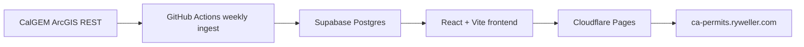

# Architecture

## V1 Shape

## Backend

The backend is a set of Python ingest scripts, not a long-running service. Scripts validate source fields, paginate ArcGIS REST responses, normalize API numbers, dedupe permit records, generate official links, and upsert into Supabase.

## Frontend

The frontend uses Supabase JS with the anon key against public read policies. It queries the `permit_activity` view and performs V1 filtering client-side.

The frontend intentionally keeps layout constraints local:

- The map component has a bounded responsive height so wide table layouts do not force excessive map height.
- Map points are rendered as individual clickable markers with a legend. Canvas clusters are disabled for now.
- Map controls support coloring by Permit Scope, Well Type, Operator, or Date. V1 uses one clean OSM basemap.
- Weekly trend, current-year operator/field stacked charts, and operator permit-rate trend are computed client-side from the loaded permit activity rows.

## Security

The Supabase anon key is safe for frontend read access because RLS permits only `select`. The service role key is used only in local `.env` files or GitHub Actions secrets.

## Deployment

Cloudflare Pages serves static files from `frontend/dist`. GitHub Actions keeps Supabase refreshed weekly. No Render/Railway/FastAPI service is required for V1.
